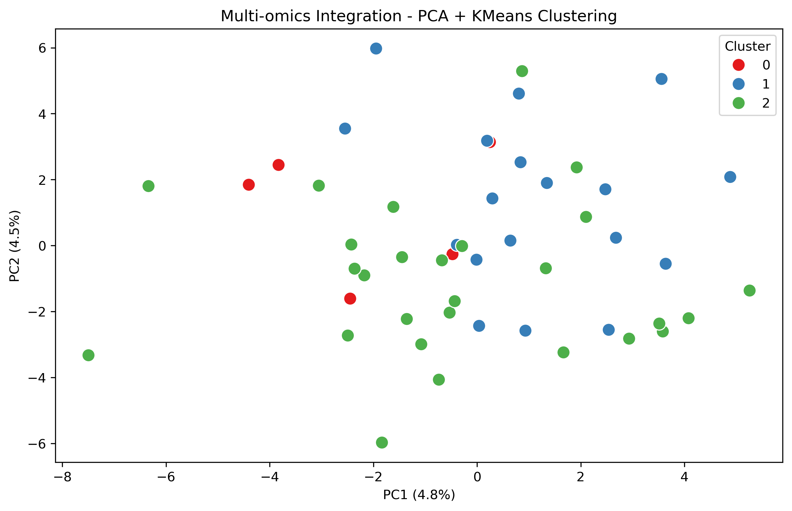
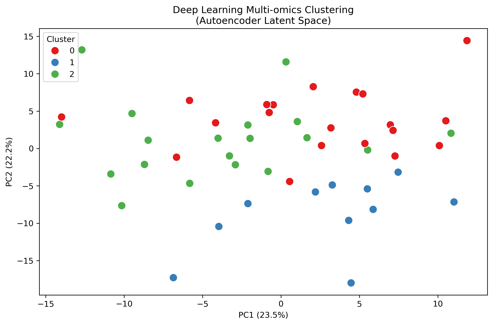
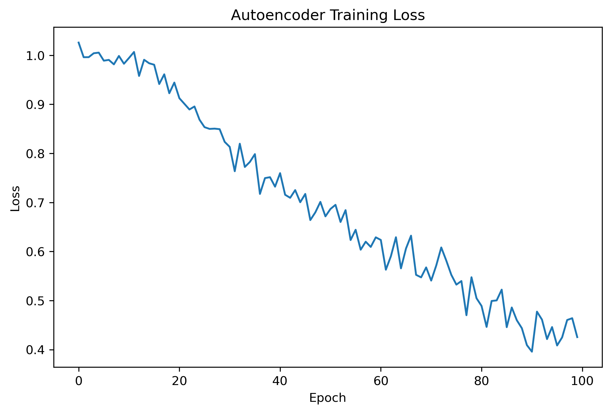

# Multi-omics ML Integration

A Python-based multi-omics data integration project combining 
RNA-Seq and WGS data using Machine Learning and Deep Learning.

## Pipeline Steps
1. Generate synthetic RNA-Seq and WGS data
2. Normalise and integrate both omics layers
3. Basic ML - PCA + KMeans clustering
4. Deep Learning - Autoencoder for latent space learning
5. Deep clustering on learned representations

## Tools and Libraries
- Python 3.13
- PyTorch 2.11
- scikit-learn
- pandas, numpy
- matplotlib, seaborn

## Usage
```bash
python3 scripts/generate_data.py
python3 scripts/integrate.py
python3 scripts/clustering.py
python3 scripts/autoencoder.py
python3 scripts/deep_clustering.py
```

## Results

### Basic ML Clustering (PCA + KMeans)


### Deep Learning Clustering (Autoencoder)


### Training Loss

